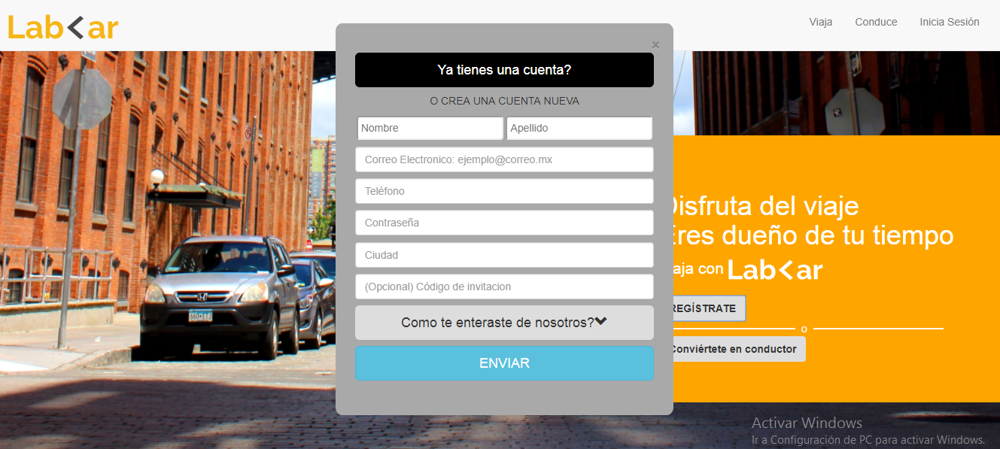

# Reto- LabCar
***

## Objetivo
Recrea la  página web LabCar mediante el framework `materialize` en la version desktop y mobile. Asimismo debe de tener los modales iniciar sesión, regístrate y conviertete en un conductor.

* Version desktop

* Version mobile

## Modales
Para los modales se utilizo la herramienta javascript del framework materialize.

### Modal Iniciar Sesión

### Modal registrate

### Modal conviertete en conductor

